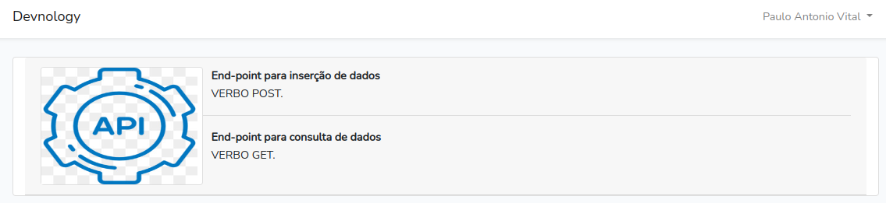

# Projeto Devnology
Teste para vaga FullStack

---
## Subindo o Docker para rodar o app
1. **sudo docker-compose build app**
2. **sudo docker-compose up -d**
3. 

---
## Instalar as dependências do composer
4. **sudo docker-compose exec app composer install**
5. **sudo docker-compose exec app composer update**
6. 

---

## crie uma chave para o artisan
7. **sudo docker-compose exec app php artisan key:generate**
8. 
---

9. Rode o Migrate **sudo docker-compose exec app php artisan migrate:refresh --seed**

---

10. Acesse o **_http://localhost:8000/_**
11. 
12. Crie seu usuario para administrar o BackEnd
13. 
14. Verifique os logs de consulta das Apis
15. 

---

16. Criação do FrontEnd - React
17. Para executar entra no diretorio **cd app-devnology**
18. Dentro do diretório para subir o servidor react **npm start**
19. Acesse o **http://localhost:3000/**
20. 

---

## crie uma chave jwt SECRET

21. Execute o comando: **sudo docker-compose exec app php artisan jwt:secret**
22. Foi utilizado o JWT para autenticar os acessos a APIs
23. 

## Desenvolvido Collection APIs RestFull

24. Todas as APIs devem ser autenticadas para que possam ser acessadas, para poder iniciar o acesso as APIs desenvolvidas realize um cadastro de usuario no form do BackEnd mecionado acima.
25. Toda Collection está dentro do projeto para ser importado para o **Postman**
26. 
27. Apos ser realizada a importação para o **Postman** terá toda collection abaixo conforme imagem
28. 
29. As Collections ShoopingCart e Products tem relações entre si, basta acessar as APIs Get com o titulo **relation**

## Segurança Criada para maior controle de acesso as APIs
30. Todas as APIs quando acessada possuem uma estrutura de gatilho para garantir o controle de acesso e o que foi realizado com elas, esse controle se encontra na base de dados pelos seguintes nomes:
 - LOG_products_brasiliam
 - LOG_products_european
 - LOG_shopping_cart
 - LOG_user
 31. 

 ## Desenvolvimento de frontEnd - React

 32. Para acessar o ambiente FrontEnd entre no diretorio -> app-devnology **npm start**
 33. 
 34. Ao acessar a tela principal com o endereço **http://localhost:3000/**
 35. 

 ---

 36. Os produtos estão dividos com **Nacionais** e **Importados** conforme pode verificar por menu
 37. 
 38. Para filtrar os produtos por categorias basta utilizar o select